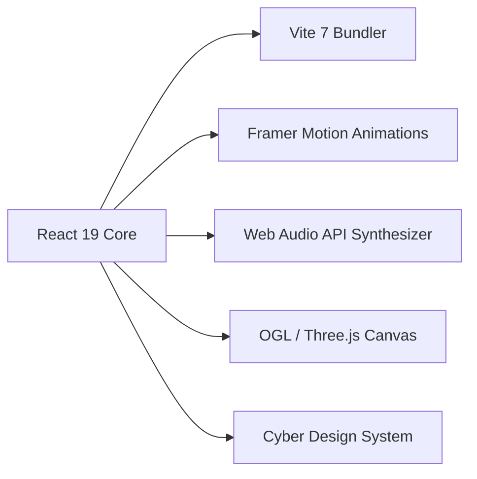

# ⚡ Code{X} — The Premier Programming Club | Woxsen University

<div align="center">

```text
    .---.____.---.     guest@codex-wou-node
   /     \  /     \    --------------------
  |   /\  \/  /\   |   OS: Code{X} Cybernet Linux 2026 (Woxsen Node)
  |  {  \    /  }  |   Host: Woxsen University School of Technology
  |   \  \  /  /   |   Kernel: 6.12.0-codex-hardened-amd64
  |    \  \/  /    |   Uptime: 24/7/365 (Active Collegiate Node)
  |    /  /\  \    |   Shell: codex-sh v2.6.0 (x86_64)
  |   /  /  \  \   |   Org: Hack Club Affiliate | Premier Tech Society
  |  {  /    \  }  |   Mentor: Dr. Amogh Deshmukh (Asst. Dean - SoT)
   \     /  \     /    President - Manish | VP - Monish
    '---'____'---'
```

[](https://react.dev/)
[](https://vitejs.dev/)
[](https://www.framer.com/motion/)
[](https://developer.mozilla.org/en-US/docs/Web/API/Web_Audio_API)
[](https://hackclub.com/)
[](./LICENSE)

**[🌐 Live Portal](https://codex-wou.vercel.app/)** • **[📸 Instagram](https://www.instagram.com/codex_wou)** • **[💼 LinkedIn](https://www.linkedin.com/company/codex-wou)** • **[💻 GitHub Org](https://github.com/CODEX-WoU/)** • **[𝕏 Twitter](https://x.com/CodeX_WOU)**

</div>

---

## 📖 Overview

**Code{X}** is the premier student-led programming society, innovation lab, and technical organization at **Woxsen University** (School of Technology). Affiliated with the global **Hack Club** network, Code{X} empowers collegiate developers through competitive hackathons, cybersecurity capture-the-flag (CTF) tournaments, hands-on bootcamps, and real-world open-source software engineering.

---

## ✨ Key Features & Architecture

### 1. 💻 Interactive Hacker CLI Drawer (`>_ TERMINAL`)
* **Neofetch Startup Screen**: Authentic Arch/Debian-style ASCII art emblem with live system telemetry upon launch.
* **Full Interactive Command Suite**: Type `help`, `neofetch`, `projects`, `events`, `team`, `achievements`, `contact`, `privacy`, `terms`, `whoami`, `clear`, or `exit`.
* **Falling Matrix Rain**: Interactive digital rain animation mode toggled with `matrix`.
* **Direct Hyperlink Integration**: Contact coordinates rendered as clean clickable handles with a pre-filled Outlook mailto template.
* **Quick-Action Chips & Window Controls**: One-tap command toolbar + fullscreen window maximize/restore toggles.

### 2. 🔬 Open-Source Innovation Lab & Project Deep Dives
* Interactive laboratory showcasing active projects:
  * 🧠 **JARVIS AI Core**: Autonomous voice & desktop agent with low-latency LLM orchestration.
  * ⚡ **AlgoArena**: Real-time 1v1 lightning code battles and sandbox test-runner.
  * 🛡️ **CyberSentinel**: Automated recon & vulnerability scanner for CTF operations.
  * 👁️ **NeuroVision Edge**: Ultra-fast edge CV inference model running at 60fps.
  * 🌐 **Code{X} Portal**: Cybernetic club platform and telemetry engine.
* **Project Deep-Dive Modal**: Architecture breakdowns, technical capabilities, tech stack tags, and live repository links.

### 3. 🔊 Zero-Latency Cyber Audio FX Synthesizer
* Pure **Web Audio API** oscillator synthesizer generating real-time sci-fi acoustic signatures for every page navigation:
  * **Home**: Quantum sub-bass power surge (120Hz → 560Hz).
  * **About**: Crystal tri-tone holographic data uplink.
  * **Projects**: Cyber core reactor overdrive saw pulse.
  * **Events**: Laser shutter frequency warp.
  * **Achievements**: Triumphant 4-note major victory fanfare.
  * **Team**: Biometric neural handshake ping.
  * **FAQ**: Tactical sonar query blip.
  * **Contact**: Sub-space carrier transmission wave.
* Controlled via a sleek floating **Cyber HUD Dock** (`🔊 / 🔇`) in the bottom-left corner.

### 4. 🏆 Hall of Fame & Achievements
* Custom-crafted cyberpunk SVG icons with glowing neon badge frames:
  * 🥇 **Smart India Hackathon Finalists** (2023 & 2025)
  * 🛡️ **Inter-College CTF Champions** (1st Place Offensive CyberSec)
  * 🎖️ **Woxsen Premier Technical Organization Award**
  * ⚡ **50,000+ Lines of Open Source Code Merged**

### 5. 🌐 Domain Tracks & Recruitment FAQ
* Personalized high-tech glyph badges:
  * `NEURAL_CORE` — AI & Machine Learning
  * `SYSTEM_LATTICE` — Web & Distributed Systems
  * `RECON_MATRIX` — Cyber Security & CTF
  * `ALGO_DUEL` — Competitive Programming
  * `CYBER_DESIGN` — UI/UX & Creative Tech
* Interactive animated FAQ accordion addressing recruitment eligibility, timelines, and preparation.

### 6. 🛡️ Production Reliability, Privacy & Legal Charter
* **Cyberpunk Error Boundary**: Client-side crash isolation with diagnostic trace dump and a 1-click `⚡ Reboot Node` button.
* **Custom 404 Cyber Screen**: Futuristic error screen with route recovery options.
* **Privacy Policy Modal**: Comprehensive data governance charter safeguarding student submissions.
* **Terms & Conditions Modal**: Collegiate code of conduct, hackathon guidelines, and open-source licensing.

### 7. 🚀 Search Engine, AI Crawler & Social Media Suite
* **JSON-LD Schema (`schema.org`)**: Structured data for `Organization`, `WebSite`, and `FAQPage` for Google Rich Results.
* **Social Previews**: Full OpenGraph and Twitter `summary_large_image` cards.
* **AI Agent Standard**: Machine-readable `llms.txt` and crawler-friendly `robots.txt`.
* **RFC 9116 Standard**: Official `security.txt` for ethical vulnerability disclosure.

---

## 🏛️ Leadership & Organization Roster

| Role | Name | Designation / Bio |
| :--- | :--- | :--- |
| **Faculty Mentor** | **Dr. Amogh Deshmukh** | Assistant Dean — School of Technology, Woxsen University |
| **President** | **Manish** | *"I write code that writes outcomes."* |
| **Vice President** | **Monish** | *"Logic on the Board. Vision in the Code."* |
| **Core Leadership** | **Nitin, Hassan, Deepti, Sudarshan, Adeeb** | Technical Domain Leads & Project Architects |
| **Executive Board** | **Sufiyan, Parth, Levin, Chandrahas, Karthika, Rian, Samarth, Chidvilas** | Operations, CTF Ops, Hackathon Logistics & Media |

---

## 🛠️ Tech Stack



| Layer | Technologies |
| :--- | :--- |
| **Frontend Framework** | React 19, JavaScript (ES6+), JSX |
| **Build Tooling** | Vite 7 (Rolldown / Lightning CSS) |
| **Animations & Transitions** | Framer Motion (Spring Physics & AnimatePresence) |
| **Audio Synthesis** | Native Web Audio API (Zero-latency procedural soundscapes) |
| **Graphics & Background** | Canvas Particle Engine & OGL WebGL shaders |
| **Styling & Aesthetics** | Pure Cyberpunk Vanilla CSS3, Glassmorphism, Responsive Grid |
| **SEO & Telemetry** | JSON-LD Structured Data, OpenGraph, `llms.txt`, `security.txt` |

---

## 🚀 Getting Started & Local Development

### Prerequisites
* **Node.js**: `v18.0.0` or higher
* **npm** / **yarn** / **pnpm**

### Installation

1. **Clone the repository**:
   ```bash
   git clone https://github.com/MSN-2007/Code-X-_Website.git
   cd Code-X-_Website/codex-website
   ```

2. **Install dependencies**:
   ```bash
   npm install
   ```

3. **Start the local development server**:
   ```bash
   npm run dev
   ```
   Open [http://localhost:5173](http://localhost:5173) in your browser to view the application.

4. **Build for production**:
   ```bash
   npm run build
   ```

5. **Preview production build locally**:
   ```bash
   npm run preview
   ```

---

## 📬 Transmission Coordinates & Connect

* 📧 **Email**: [codex@woxsen.edu.in](mailto:codex@woxsen.edu.in?subject=Inquiry%20to%20Code%7BX%7D%20Woxsen)
* 📸 **Instagram**: [@codex_wou](https://www.instagram.com/codex_wou)
* 💼 **LinkedIn**: [Code{X} Woxsen](https://www.linkedin.com/company/codex-wou)
* 💻 **GitHub Organization**: [@CODEX-WoU](https://github.com/CODEX-WoU/)
* 𝕏 **Twitter / X**: [@CodeX_WOU](https://x.com/CodeX_WOU)
* 📍 **Base**: School of Technology, Woxsen University, Hyderabad, Telangana, India.

---

<div align="center">

© 2026 **Code{x}** — The Programming Club, Woxsen University. All rights reserved.  
*Built with ❤️ & caffeine by the Code{X} Engineering Squad.*

</div>
